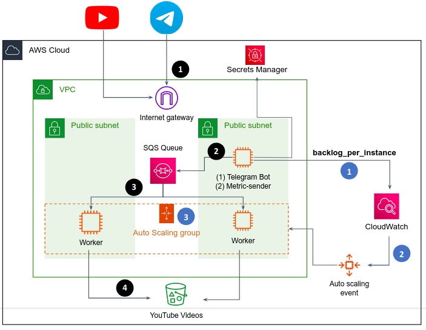
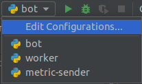

# AWS Ex1 - Provision the TelegramAI app in AWS

**Can be done in pairs (highly recommended)**.

**Never commit (and push) AWS credentials! No credentials file is needed to be placed in the repo directory.**

## Background

Your goal is to provision the TelegramAI chat app as a scalable, micro-services architecture in AWS.

Here is a high level diagram of the architecture:



## Scaling the app

When end-users send a message via Telegram app (1-black), the messages are served by the Bot service (run as a Docker container in the Telegram Bot EC2 instance).
The Bot service **doesn't** download the video from YouTube itself, otherwise, all it does is sending a "job" to an SQS queue (2-black), and return the end-user a message like "your video is being downloaded...".
So, the Bot service is a very lightweight app that can serve hundreds requests per seconds. 
In the other side, there are Worker service (run as a Docker container in the Worker EC2 instance) **consumes** jobs from the SQS queue (3-black) and does the hard work - to download the video from YouTube and upload it to S3 (4-black). When the Worker done with current job, it asks the SQS queue if it has another job for him. As long as there are jobs pending in the queue, a free Worker will consume and perform the job. In such way the Bot service pushes jobs to the SQS queue, making it "full", while the Worker service consumes jobs from the queue, making it "empty".

But what if the rate in which the Bot service is pushing jobs to the queue is much higher than the rate the Worker completing jobs? In such case the queue will overflow...
To solve that, we will create multiple workers that together consume jobs from the queue. How many workers? we will deploy a dynamic model **that auto-scale the number of workers** depending on the number of messages in the queue. 
When there are a lot of jobs in the queue, the autoscaler will provision many workers. 
When there are only a few jobs in the queue, the autoscaler will provision fewer workers.
The Workers are part of an AutoScaling group, which is scaled in and out by a custom metric that the Metric Sender service (run as a Docker container as well, on the same VM as the Bot service) writes to CloudWatch every 1 minute (1-blue). CloudWatch will trigger an autoscale event (2-blue) when needed, which results in provisioning of another Worker instance, or terminate a redundant Worker instance (3-blue). 

The metric sent to CloudWatch can be called `BacklogPerInstance`, as it represents the number of jobs in the queue (jobs that was not consumed yet) per Worker instance.
For example, assuming you have 5 workers up and running, and 100 messages in the queue, thus `BacklogPerInstance` equals 20, since each Worker instance has to consume ~20 messages to get the queue empty. For more information, read [here](https://docs.aws.amazon.com/autoscaling/ec2/userguide/as-using-sqs-queue.html).

In the [TelegramAI](https://github.com/alonitac/TelegramAI) repo, review `microservices` branch. This branch contains the code for the above services, you don't need to bring your own code from the previous exercise.

### Merge the branch to your forked repo

Execute the following steps from the root directory of **your forked TelegramAI** repo.

1. Add the following Git remote under the name `upstream`:
```shell
git remote add upstream https://github.com/alonitac/TelegramAI.git
```

2. Pull the branches from the new added remote:
```shell
git pull upstream
```

3. Checkout `upstream/microservices` into a local branch `microservices`:
```shell
git checkout -b microservices upstream/microservices
```

From now on, throughout the exercise you should work on your `microservices` branch. 

### The TelegramAI repo structure 

The repository structure is divided into services - each service under its own directory, while all services are sharing common files (`config.json` and `utils.py`) under the root directory of the repo.

1. `bot/app.py` - The Telegram bot code, similar to what you've implemented in the previous exercise. But this time, the bot doesn't download the videos itself, but sends a "job" to an SQS queue.
2. `worker/app.py` - The Worker service continuously reads messages from the SQS queue and process them, which means download the video from YouTube and store it in a dedicated S3 bucket.
3. `metric-sender/app.py` - The Metric Sender service calculates the `backlog_per_instance` metric and send it to CloudWatch.

Each service has its own `Dockerfile` under the service's directory.

Note: the services should be run from the root directory of the repo (PyCharm usually run applications from the directory the Python file is located, e.g. the Bot app will be run from `TelegramAI/bot/` dir instead of `TelegramAI/`).
For your convenience, in branch `microservices`, the run configurations of each service is already there:  



Just choose the service and click "run".

## Guidelines

### AWS resources

1. Create a VPC with at least 2 public subnets (no need to create a private subnet).

2. Create an S3 bucket which will store the uploaded YouTube videos.

3. Create an SQS **standard** queue. Jobs that was not processed yet should reside in the queue for a maximum period of **4 days**. The worker has a maximum period of **30 minutes** to process a single job.

4. Create a Launch Template and an AutoScaling Group. Keep the default configurations, we will change it later. The **Minimum and Desired** capacity of the ASG should be **0**.

5. Create a secret in Secret Manager containing your Telegram token. Under **Secret type** choose **Other type of secret** and enter the secret content in the following format:


### The Code

7. Change `config.json` according to your resources in AWS. This file is being used by the different services, hence it is located under in the repo root directory.  

8. You are given most of the code for the Bot, Worker and Metric-sender services. Complete the following *TODO*s:

   1. In `worker/app.py` complete the implementation of `process_msg()` function such that the downloaded videos will be uploaded to S3 (you can delete them from the disk afterwards).
   2. In `bot/app.py` complete `get_telegram_token_secret()` such that this function returns the value of your Telegram token.
   3. In `metric-sender/app.py` complete `lambda_handler()` such that the value of variable `backlog_per_instance` will be sent as a metric to [CloudWatch](https://boto3.amazonaws.com/v1/documentation/api/latest/guide/cw-example-metrics.html#publish-custom-metrics).

Except the above changes, you don't need to change the code (unless you want to add more functionality to the service).

### Test your app locally

9. After you've implemented the code changes, it is good idea to test everything locally. Run the `bot/app.py` service and a single worker `worker/app.py`. Make sure that when you send a message via Telegram, the Bot service produces a message to the SQS queue, and the Worker consumes the message, downloads the YouTube video and uploads it to S3.

### Deploy the app in AWS 

10. As mentioned above, all services are running as a Docker containers. Complete the Dockerfile of each service (except `lambda.Dockerfile` which is already implemented).
12. Deploy the Worker service to an EC2 instance
    1. Create an Amazon Linux EC2 instance.
    2. Install Docker.
    3. Get your repo code there (install Git if needed).
    4. Build the Worker image by (note that the build command should be run from the root directory of the repo, also note the `-f` option which helps when the `Dockefile` is located in a different dir than the build context):
       ```shell
       docker build -t worker:1.0 -f worker/Dockerfile . 
       ```
    5. Run the container such that it starts automatically when the EC2 is launches:
       ```shell
       docker run -d --name worker --restart always worker:1.0  
       ```
    6. Create an AMI from that instance and base your Launch Template on that AMI, such that when a new instance is created from the launch template, the Worker app will be up and running automatically.

11. Deploy the Bot and the Metric-sender services **on a single EC2 instance** (those services are not part of the autoscaling group). It should be similar to Worker deployment - each service in a separate Docker container that restarts automatically on OS reboot.

13. Use AWS cli to create a [target tracking scaling policy](https://docs.aws.amazon.com/autoscaling/ec2/userguide/as-using-sqs-queue.html#create-sqs-policies-cli) in your Autoscaling Group. `MetricName` and `Namespace` should correspond to the metric your Bot service is firing to CloudWatch. Give the `TargetValue` some value that you can test later (e.g. 10, which means if there are more than 10 messages per worker in the SQS queue, a scale up event will trigger).

14. Make sure your services are given the right IAM role permissions.

15. Test your application and make sure the autoscalig group react under load increase/decrease.

## Lambda workers 

We now want to examine a serverless architecture of Bot-Workers dynamic:


Instead of scaling EC2 instance with the Worker service deployed there, you will trigger Lambda functions when there are jobs in the SQS queue.

1. Terminate the Metric Sender services such that no metrics will be sent to CloudWatch and the ASG doesn't scale anymore.
2. Create a Docker based Lambda function for the Worker service.
    1. In order to do so, first you need to build and push a Docker image on Elastic Container Registry (ECR). Using the AWS console, create a private ECR.
    2. On your local machine, build the image of the Worker (according to `lambda.Dockerfile`. It's already implemented, no need to touch) and push it to your ECR registry. In [Amazon ECR console](https://console.aws.amazon.com/ecr/repositories), select the repository that you created and choose **View push commands** to view the steps to build and push an image from your local machine to your new repository\. You may use this command to build the image:
       ```shell
       cd worker && docker build -t worker:0.1 -f worker/lambda.Dockerfile . 
       ```
    3. Create a Lambda function based on your container image you've just pushed to ECR.
3. Define your SQS queue as a trigger that invokes your function. 
4. Test your app in this new architecture, make sure the Lambda is triggered when you send a message to the Bot, and when the execution ends, the YouTube video is in stored in S3.

## Submission

Present you work in a personal meeting (usually 20 minutes before our bi-weekly class). **Final due date is 15/02/23**.

# Good Luck

Don't hesitate to ask any questions
