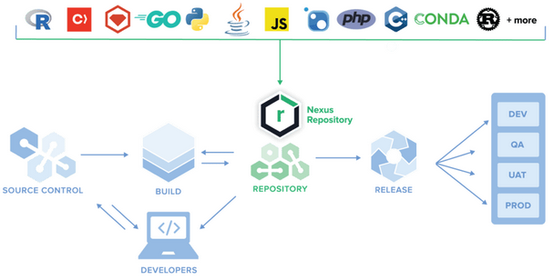

# Artifact repositories 

## The problem

CI/CD brings a many benefits, but...

When committing changes regularly by many teams, an automated CI/CD pipeline produces a considerable number of builds each day. Every build can potentially download or create hundreds of artifacts, e.g. Python packages, Docker images, Git repositories, etc...  

There are several problems that arise as a result:

- First and most - software vulnerabilities can easily propagate to Production environment! 
- CI/CD is blocked due to 3rd party unavailability.
- Your team can innocently violate software licensing. 


Build (or Binary) artifacts are the files created by the build process, such as Docker images, dependencies packages, WAR files, logs, and reports.
An **artifact repository** provides a central location to store and manage those builds.

## The solution 

- Repeatable and fast builds every time.
- Give your teams a single source of truth for every component.
- Optimize build performance and storage costs by caching artifacts.
- Instant visibility into your consumption of vulnerable open source.
- Better comply with licensing policies.


# Nexus Repository Manager



## Install

We will deploy the Nexus server using a [pre-built Docker image](https://hub.docker.com/r/sonatype/nexus3/).

Run on a `*.small` EC2 instance:

```shell
sudo mkdir /nexus-data && sudo chmod 777 /nexus-data
docker run -d --rm -p 8081:8081 --name nexus -v /nexus-data:/nexus-data -e INSTALL4J_ADD_VM_PARAMS="-Xms400m -Xmx400m -XX:MaxDirectMemorySize=400m" sonatype/nexus3
```

## Repository Management

Nexus ships with a great [Official docs](https://help.sonatype.com/repomanager3/nexus-repository-administration/repository-management) and compatible with [many package managers](https://help.sonatype.com/repomanager3/nexus-repository-administration/formats): Java/Maven, npm, NuGet, PyPI, Docker, Helm, Yum, and APT.

### Repository Types

#### Proxy repo

Proxy repository is a repository that is linked to a remote repository. Any request for a component is verified against the local content of the proxy repository. If no local component is found, the request is forwarded to the remote repository.

#### Hosted repo

Hosted repository is a repository that stores components in the repository manager as the authoritative location for these components.

#### Group repo

Repository group allow you to combine multiple repositories and other repository groups in a single repository.
This in turn means that your users can rely on a single URL for their configuration needs, while the administrators can add more repositories and therefore components to the repository group.


## Create a PyPi **proxy** repo

1. After signing in to your Nexus server as an administrator, click on the **Server configuration** icon.
2. Create a [PyPi repo](https://help.sonatype.com/repomanager3/nexus-repository-administration/formats/pypi-repositories).
3. On your machine, in some local Python repository, [configure](https://help.sonatype.com/repomanager3/nexus-repository-administration/formats/pypi-repositories#PyPIRepositories-Download,searchandinstallpackagesusingpip) `pip` to download packages from your private artifact repository. To do so, create a file `pip.conf` with the following content:
```text
[global]
trusted-host = <nexus-host>
index-url = http://<nexus-host>:8081/repository/<repo-name>/simple
index = http://<nexus-host>:8081/repository/<repo-name>
```

While changing `<nexus-host>` to the DNS/IP of your server.

5. Put the `pip.conf` file either in your virtual env folder (`venv`). Alternatively (when installing packages outside a virtual env, e.g. in Jenkins agent), define a custom location by setting the following env var: `PIP_CONFIG_FILE=<path-to-pip-conf>`. Note that there are many [other methods](https://pip.pypa.io/en/stable/topics/configuration/#location).

## Repository Health Check

https://help.sonatype.com/repomanager3/nexus-repository-administration/repository-management/repository-health-check

## Define s3 as an artifacts storage

https://help.sonatype.com/repomanager3/nexus-repository-administration/repository-management/configuring-blob-stores#ConfiguringBlobStores-AWSSimpleStorageService(S3)

## Create a PyPi **hosted** repo, pack and upload a Python library

1. Create a `pypi (hosted)` repo.
2. Set the configured S3 as the blob store.

### Build a Python package

You can share reusable code (in the form of a library) and programs (e.g., CLI/GUI tools) implemented in Python.
[Setuptools](https://setuptools.pypa.io/en/latest/index.html) is a Python library designed to facilitate packaging Python projects.

Under `15_fantastic_ascii`, you are given a sample source code for a library called "fantastic_ascii". We will pack and publish the code as a Python library.

The [official quick start](https://setuptools.pypa.io/en/latest/userguide/quickstart.html) of Setuptools is a good starting point of how to do it. Take a look on the quick start guide in the docs.

1. Install `build` library by `pip install --upgrade build`.
2. Open a terminal in the library source code, build the package by: `python -m build`.  
   You now have your distribution ready (e.g. a tar.gz file and a .whl file in the dist directory), which you can upload to your private PyPi repo.

### Distribute your package using twine

6. You can use [twine](https://twine.readthedocs.io/en/latest/) to upload the distribution packages. You’ll need to install Twine: `pip install --upgrade twine`.
7. In order to upload your package to the PyPi repo in Nexus, configure the `.pypirc` file [as describe in Nexus docs](https://help.sonatype.com/repomanager3/nexus-repository-administration/formats/pypi-repositories#PyPIRepositories-Uploadtoahostedrepositoryusingtwine).
8. Upload your package by:
```text
python3 -m twine upload --config-file <path-to-.pypirc-file> --repository <pypi-repo-name> dist/*
```

## Jenkins integration

### Fantastic ASCII Build pipeline

Create a Jenkins Pipeline that builds the `fantastic_ascii` package. General guidelines:

- The pipeline is triggered **manually** from Jenkins dashboard.
- The pipeline checks if the package version specified in `setup.py` exists in Nexus. If it doesn't exist, the pipeline builds and upload the package (as done in the two sections above).
- Store Nexus username and password as a Jenkins credential and use them with `withCredentials()`.

### Install Python dependencies from Nexus repo

Recall that whenever a Docker image is being built as part of a Jenkins pipeline running, the Docker engine install Python packages in your image (the Dockerfile contains `RUN pip install....`).
Configure your Jenkins server to download and install packages from your Nexus server.
